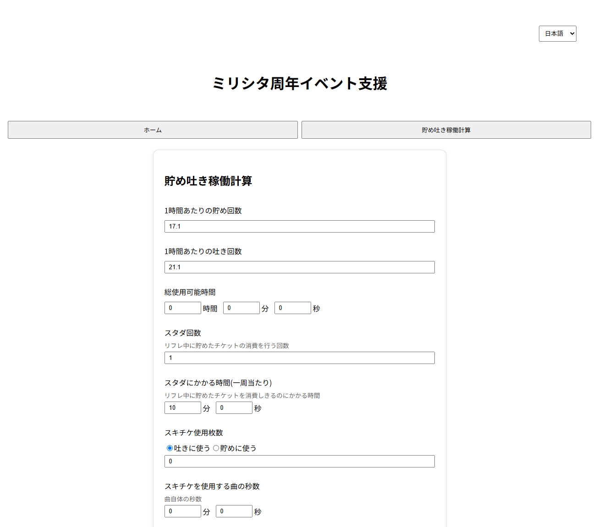
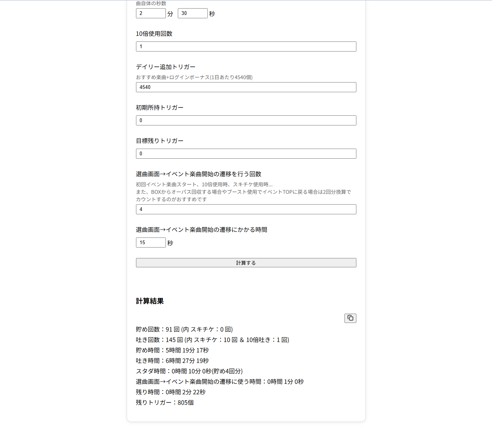

## MLTD event planner




MLTD Event Planner is a web application that calculates the optimal number of "point-stocks" and "point-spending" runs during a *THE iDOLM@STER Million Live! Theater Days* anniversary event, based on the hourly rates at which points are earned and spent.

## Getting Started

### 1. Configration
Copy `event-planner-api/src/main/resources/application.properties` to create `application-dev.properties`, and enter the configuration values ​​required for Discord OAuth2.

* `discord.client-id`: Discord OAuth2 Client ID
* `discord.client-secret`: Discord OAuth2 Client Secret
* `discord.bot-token`: Bot token used to retrieve role information
* `discord.redirect-uri`: OAuth 2 Redirect URI

* `discord.target-guild-ids[0]`: Discord server (guild) ID subject to authentication
* `discord.target-role-ids[0]` Discord role ID to grant access

Please obtain the Discord OAuth2 Client ID, Client Secret, and Bot Token from the application created in the Discord Developer Portal.
- [Building your first Discord Bot](https://docs.discord.com/developers/quick-start/getting-started)

### 2. Build
This application supports Docker Compose and can be built and started using the following commands.
```
docker compose -f docker-compose.dev.yml -d --build
```
This command starts all services, including the React frontend, Spring Boot backend, and Caddy.

After the build is complete, please access the following URL.
- https://localhost

## Authentication

As this application is intended for participants of a specific Discord server, it utilizes Discord OAuth2 for authentication.
When accessing the application, Discord authentication is required to use the service.


